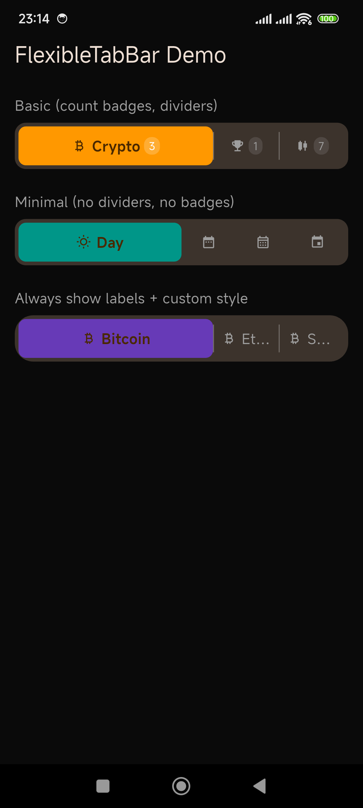
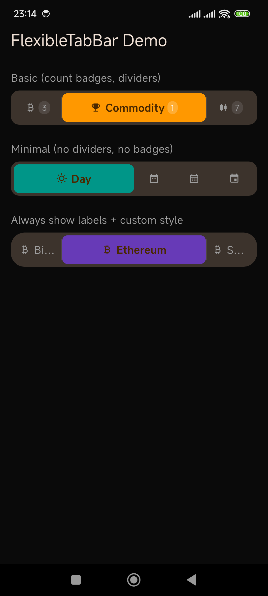

# FlexibleTabBar

[]()
[](https://pub.dev/packages/flexible_tab_bar)
[]()

A beautifully animated, flex-based tab bar for Flutter.

**Active tabs expand horizontally**, inactive tabs compact — with icons, labels, optional count badges, and smooth `AnimatedContainer` transitions.

Perfect when you need a compact tab bar where the active tab stands out with more space and the inactive tabs stay out of the way.

## Why this package?

Flutter's built-in `TabBar` is great, but it has rigid constraints:

- **Fixed-width tabs** — every tab gets equal space, even if only one matters
- **No badges** — no built-in way to show counts/notifications on tabs
- **No animation control** — the indicator slide is the only motion
- **Opinionated layout** — tightly coupled with `TabBarView` and `DefaultTabController`

`FlexibleTabBar` solves all of this:

| Problem | FlexibleTabBar solution |
|---------|------------------------|
| Equal-width tabs waste space | Active tab flexes to 3x width, inactives compact |
| Need count badges on tabs | Built-in `count` parameter per tab |
| Tabs feel static | `AnimatedContainer` transitions on every property change |
| Coupled to TabController | Simple controlled widget — bring your own state |

If you've ever wanted a tab bar where "the active tab stands out" and "I can show a badge count without hacking", this is for you.

## Screenshots


*Default layout — 3 tab variants (basic with badges, minimal no-dividers, always-show-labels)*


*After tapping Commodity and Week — active tabs reflow with animation*

## Features

- ✅ Smooth animated tab switching (expand/compact)
- ✅ Custom icons per tab (with optional active-state icon override)
- ✅ Optional count badges on each tab
- ✅ Customizable colors, border radius, and spacing
- ✅ Vertical dividers between tabs (toggle on/off)
- ✅ Option to always show labels (not just when active)
- ✅ Zero external dependencies — pure Flutter Material
- ✅ Works on all platforms (Android, iOS, Web, macOS, Windows, Linux)

## Installation

Add to your `pubspec.yaml`:

```yaml
dependencies:
  flexible_tab_bar: ^0.1.0
```

Or use the latest version from git:

```yaml
dependencies:
  flexible_tab_bar:
    git: https://github.com/trinhnx/flexible_tab_bar.git
```

## Quick Start

```dart
import 'package:flexible_tab_bar/flexible_tab_bar.dart';

// Inside a StatefulWidget:
FlexibleTabBar(
  tabs: const [
    FlexibleTab(
      label: 'Crypto',
      icon: Icon(Icons.currency_bitcoin),
      count: 3,
    ),
    FlexibleTab(
      label: 'Commodity',
      icon: Icon(Icons.emoji_events),
      count: 1,
    ),
    FlexibleTab(
      label: 'Stocks',
      icon: Icon(Icons.candlestick_chart),
      count: 7,
    ),
  ],
  selectedIndex: _selectedIndex,
  onTabChanged: (index) {
    setState(() => _selectedIndex = index);
  },
  activeColor: Colors.orange,
  inactiveColor: Colors.grey,
)
```

## Integration Guide

### 1. Basic Setup

Wrap your app in a `MaterialApp` (or use within any existing Flutter project). The widget works with any theme — light, dark, or custom.

### 2. State Management

`FlexibleTabBar` is a simple controlled widget. You manage the `selectedIndex` yourself:

```dart
int _selectedIndex = 0;

FlexibleTabBar(
  selectedIndex: _selectedIndex,
  onTabChanged: (i) => setState(() => _selectedIndex = i),
  // ...
)
```

This works with any state management approach:
- `setState` 
- Provider / Riverpod
- Bloc / Cubit
- GetX
- Any other state solution

### 3. Responding to Tab Changes

Use `selectedIndex` to control what content is shown:

```dart
// With IndexedStack (preserves state):
IndexedStack(
  index: _selectedIndex,
  children: [
    WalletPage(),
    HistoryPage(),
    SettingsPage(),
  ],
)

// Or conditional rendering:
if (_selectedIndex == 0)
  CryptoDashboard()
else if (_selectedIndex == 1)
  CommodityList()
else
  StockPortfolio()
```

### 4. Styling

```dart
FlexibleTabBar(
  activeColor: Colors.orange,         // Active tab pill color
  inactiveColor: Colors.grey,          // Inactive icon/text color
  activeCountBadgeColor: Colors.white.withOpacity(0.2), // Badge bg (active)
  inactiveCountBadgeColor: Colors.grey.withOpacity(0.2),// Badge bg (inactive)
  backgroundColor: Color(0xFF1E1E1E),  // Container background
  borderRadius: BorderRadius.circular(16), // Roundness
  padding: EdgeInsets.all(6),          // Outer padding
  animationDuration: Duration(milliseconds: 300), // Transition speed
)
```

### 5. Compact Mode (no labels when inactive)

By default, labels only show for the active tab (saves space). If you want all labels visible:

```dart
FlexibleTabBar(
  alwaysShowLabel: true,
  // ...
)
```

### 6. No Badges

Simply omit the `count` field or set it to `null`:

```dart
FlexibleTab(label: 'Day', icon: Icon(Icons.wb_sunny)),
```

### 7. Custom Active Icon

Use a different icon when the tab is selected:

```dart
FlexibleTab(
  label: 'Bitcoin',
  icon: Icon(Icons.currency_bitcoin, color: Colors.grey),
  activeIcon: Icon(Icons.currency_bitcoin, color: Colors.white),
)
```

### 8. Theming

`FlexibleTabBar` respects `Theme.of(context)` for default colors:
- `activeColor` → uses your seed color via `colorScheme.onPrimary`
- `backgroundColor` → uses `colorScheme.surfaceContainerHighest`
- Active tab icon/text → `colorScheme.onPrimary`

## AI Agent Integration Guide

Coding agents (Cursor, Copilot, Codeium, etc.) can use this section to understand how to integrate `FlexibleTabBar` into a project.

### Package identity

- **Pub:** `flexible_tab_bar` — add to `pubspec.yaml` dependencies
- **Import:** `package:flexible_tab_bar/flexible_tab_bar.dart`
- **Classes:** `FlexibleTabBar` (widget) + `FlexibleTab` (data model)
- **Min Flutter SDK:** `>=3.27.0`

### Integration checklist for agents

1. **Add dependency** — `flutter pub add flexible_tab_bar`
2. **Create state** — `int _selectedIndex = 0;` in the consumer widget
3. **Build tabs** — list of `FlexibleTab(label:, icon:, count?, activeIcon?)`
4. **Wire widget** — `FlexibleTabBar(tabs:, selectedIndex:, onTabChanged:)`
5. **Show content** — switch on `selectedIndex` for the area below the bar

### Common patterns an agent should recognize

| Developer intent | What to use |
|---|---|
| "Show labels on all tabs" | `alwaysShowLabel: true` |
| "Notification counts" | `count:` on `FlexibleTab` |
| "No vertical lines" | `showDivider: false` |
| "Slower animation" | `animationDuration: Duration(milliseconds: 500)` |
| "Different active icon" | `activeIcon:` on `FlexibleTab` |
| "Match my theme" | Omit `activeColor`/`backgroundColor` — defaults use `Theme` |

### Agent behavior rules

This file is structured so agents can parse integration instructions without ambiguity. When a developer asks you to integrate `flexible_tab_bar`:

1. **Do NOT** wrap it in a `DefaultTabController` or `TabController` — it's a controlled widget
2. **Do NOT** use `Tab` or `TabBar` — use `FlexibleTab` and `FlexibleTabBar`  
3. **DO** create an `int` state variable for `selectedIndex`
4. **DO** use `IndexedStack` if preserving child state across tab switches

## Screenshots guide for developers

To capture your own screenshots:

```bash
# Run the example app
cd example/
flutter run

# Capture from connected device
adb exec-out screencap -p > screenshot.png
```

## API Reference

### FlexibleTabBar

| Parameter | Type | Default | Description |
|-----------|------|---------|-------------|
| `tabs` | `List<FlexibleTab>` | (required) | The tabs to display |
| `selectedIndex` | `int` | (required) | Currently selected tab index |
| `onTabChanged` | `ValueChanged<int>` | (required) | Callback when a tab is tapped |
| `activeColor` | `Color` | `Colors.orange` | Active tab background |
| `inactiveColor` | `Color` | `Colors.grey` | Inactive icon/text color |
| `backgroundColor` | `Color?` | theme surface | Container background |
| `dividerColor` | `Color?` | white 30% | Vertical divider color |
| `padding` | `EdgeInsetsGeometry` | `all(4)` | Container padding |
| `borderRadius` | `BorderRadiusGeometry` | `circular(12)` | Container & tab radius |
| `animationDuration` | `Duration` | `300ms` | Transition duration |
| `animationCurve` | `Curve` | `easeInOut` | Transition curve |
| `showDivider` | `bool` | `true` | Show vertical dividers |
| `dividerThickness` | `double` | `1.0` | Divider width |
| `crossAxisAlignment` | `CrossAxisAlignment` | `stretch` | Row cross-axis alignment |
| `tabPadding` | `EdgeInsetsGeometry` | `sym(v:10)` | Inner tab padding |
| `alwaysShowLabel` | `bool` | `false` | Show labels on inactive tabs |
| `activeTextStyle` | `TextStyle?` | bold 13px white | Active label style |
| `inactiveTextStyle` | `TextStyle?` | 13px grey | Inactive label style |
| `countBadgeTextStyle` | `TextStyle?` | 10px white/grey | Badge number style |
| `activeCountBadgeColor` | `Color?` | white 20% | Badge bg (active) |
| `inactiveCountBadgeColor` | `Color?` | grey 20% | Badge bg (inactive) |

### FlexibleTab

| Parameter | Type | Description |
|-----------|------|-------------|
| `label` | `String` | Tab display label |
| `icon` | `Widget` | Tab icon (any widget) |
| `count` | `int?` | Optional badge count |
| `activeIcon` | `Widget?` | Optional icon override when selected |

## Example

Run the example app:

```bash
cd example/
flutter run
```

The example demonstrates:
- Basic usage with count badges and vertical dividers
- Minimal mode (no dividers, no badges) for time-period tabs
- Always-show-labels with custom styling and slower animation
- Integration with a dark-themed app

## Changelog

See [CHANGELOG.md](CHANGELOG.md).

## License

MIT — see [LICENSE](LICENSE).
